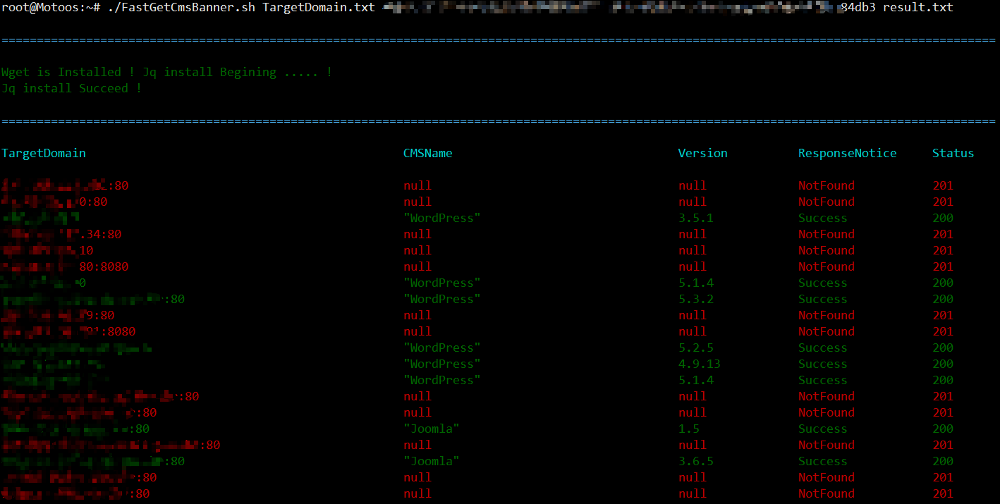

### 0x01 用法
```
Use:
   # tested on ubuntu 16.04 
   # ./FastGetCmsBanner.sh  目标子域列表文件 WhatCMSApiKey 保存探测结果的文件名[随意]
   # ./FastGetCmsBanner.sh TargetDomain.txt 2008cce12f319c5f2f3269438d50935ce4260d6 result.txt
```

### 0x02 实战应用场景
```  
目标网络规模非常大,通过前期子域搜集,发现至今仍处于存活状态的域名大概有好几千个
如何从这几千个域名中定位识别出可能存在特定漏洞的开源程序版本,快速打开突破口,便成了首要思考的问题
脚本也是为了服务于此场景,就地取材,借助WhatCMS提供的接口来批量获取,提高渗透效率
注: 需要特别说明的是,WhatCMS 并不适合国情,很多境内的开源程序指纹都并未收录,如果您的目标在境外,大可不妨一试
```

### 实测效果demo



### 脚本仅限于安全研究学习和授权渗透之用
### 严禁将其用于任何恶意非法用途，由此所产生的一些法律责任，均由使用者自行承担
